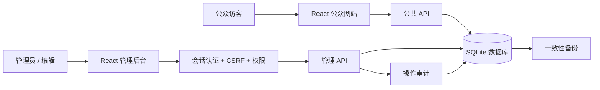
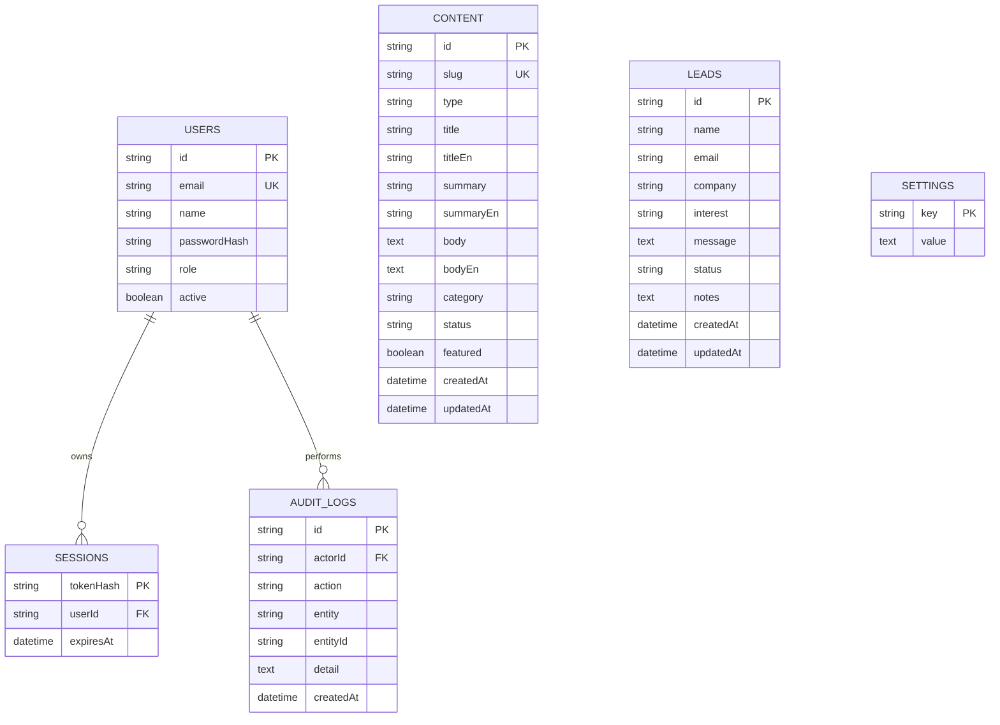

# 架构、数据与信任边界

## 1. 可运行架构



前端由 React、React Router、Vite 构建；官网与管理后台按路由分别加载。后端为 Node.js 24、Express 与 Zod。数据库使用 Node 内置 SQLite 驱动，数据库文件单独保存，不使用浏览器 localStorage 模拟业务数据。SQLite 适用于本版单实例官网 CMS 与咨询量级；大量并发写入、多实例或多区域部署时需要迁移 PostgreSQL 等服务端数据库。

## 2. 数据实体与关系



上图为逻辑模型，精确 SQL 字段、索引和约束以 `server/schema.sql` 为准。所有 SQL 使用绑定参数；公开内容查询限制 status=published；认证接口返回用户最小必要字段。

## 3. 数据生命周期

- 第一次启动：执行表结构迁移；无账号时从环境配置创建初始管理员；无初始内容时写入双语示例官网文案。
- 编辑内容：验证请求 → 确认权限 → 保存内容 → 写审计 → 返回结果；发布与草稿可切换。
- 提交咨询：字段与 consent 验证 → 限流／蜜罐 → 插入线索 → 返回确认；不触发第三方通讯。
- 登录：校验账号状态与密码 → 创建限时会话 → HttpOnly Cookie；原始会话令牌不进入数据库。
- 退出／密码变化／账号停用：会话失效策略执行；新的受保护请求必须重新通过认证。
- 备份：使用 SQLite backup API，而不是在 WAL 运行期间直接复制单个主数据库文件。
- 恢复：停服 → 保留现有数据库与 WAL／SHM → 放回备份 → 启动 → 完整性与业务回归检查。

## 4. 请求安全设计

| 层级 | 实现 |
|---|---|
| 传输 | 本机默认监听 127.0.0.1；正式站需 HTTPS 反向代理 |
| 来源 | 写请求验证 Origin；开发来源需要显式白名单 |
| 会话 | HttpOnly、SameSite Cookie；生产环境 Secure；服务端过期时间 |
| CSRF | 登录后返回独立 token，受保护写请求提交 X-CSRF-Token |
| 密码 | scrypt＋随机盐；不明文持久化 |
| 访问控制 | 每个管理端点校验角色，不依赖前端菜单 |
| 输入 | Zod 类型和长度验证、请求体体积限制、slug 唯一约束 |
| SQL | 绑定参数，避免将输入拼接为 SQL |
| 内容输出 | 文本渲染，不执行用户 HTML |
| 基础滥用防护 | 登录与咨询限流、蜜罐；默认不盲信 X-Forwarded-For |
| 浏览器 | Content-Security-Policy、点击劫持与类型探测相关响应头 |
| 审计 | 内容／账号／设置／线索变更进入 audit_logs |

当前限流状态在单进程内，重启即重置；多实例需 Redis 等共享限流。当前未实现 MFA、密码邮件找回或企业 SSO。

## 5. 目录

```text
cct-platform/
  src/                 React 官网、后台及样式
  public/              本地静态品牌资源
  server/              API、认证、数据库、SQL 表结构、种子内容
  scripts/             初始化与备份
  tests/               后端行为测试
  qa/                  浏览器验收脚本、报告、截图
  docs/                产品、接口、部署和验收文档
  dist/                可由后端托管的构建结果
  data/                SQLite 数据库（不提交）
  .env                 本机配置（不提交）
  LOCAL-ACCESS.md       本机初始访问凭据（不提交）
```
